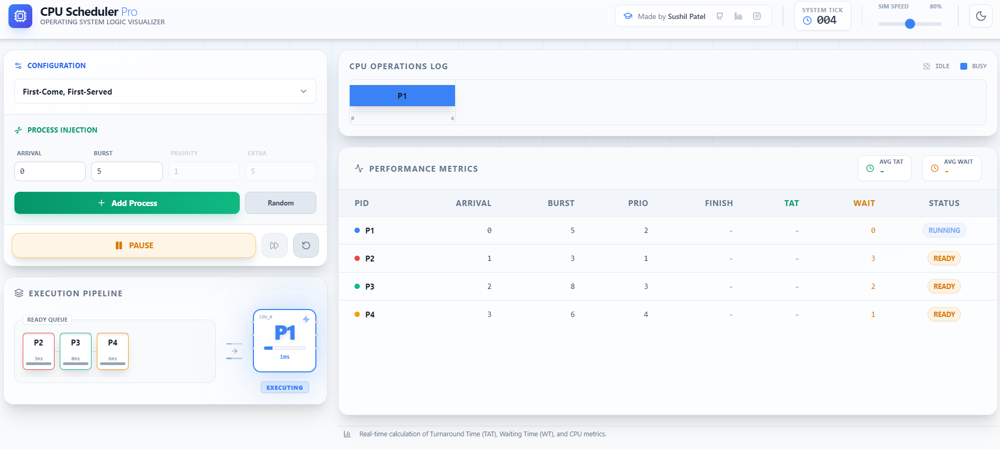
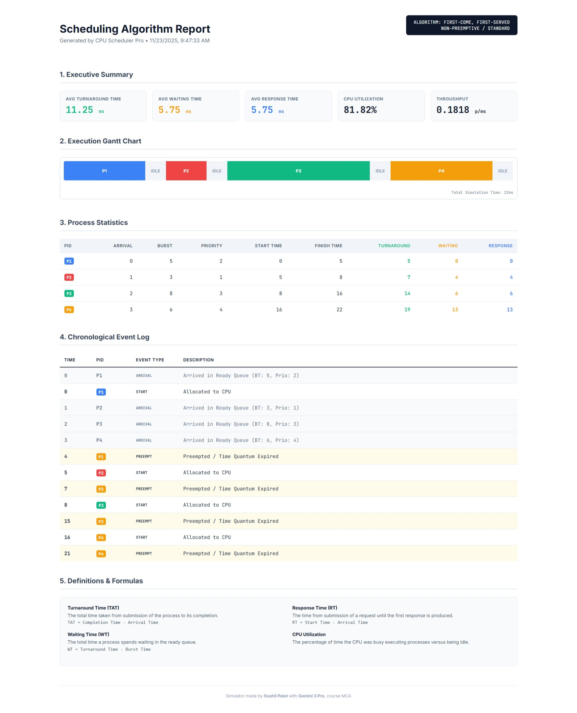

<div align="center">

# ⚡ CPU Scheduler Pro
### Advanced Operating System Logic Visualizer


<br/>

<a href="https://cpu-scheduler-pro.vercel.app" target="_blank">
  
</a>

<br/>
<br/>

[](https://reactjs.org/)
[](https://www.typescriptlang.org/)
[](https://vitejs.dev/)
[](https://tailwindcss.com/)

<br/>

<p align="center">
  <b>A powerful, interactive, and educational tool to visualize CPU scheduling algorithms in real-time.</b><br/>
  Designed for students, developers, and OS enthusiasts to understand the core concepts of process management.
</p>

</div>

---

## 🚀 Features

### 🎨 Interactive Visualization
- **Real-time Gantt Chart**: Watch processes get scheduled on the CPU tick-by-tick.
- **Dynamic Ready Queue**: Visualize the state of the waiting queue with progress bars and status indicators.
- **Process States**: Clear visual distinction between `READY`, `RUNNING`, `WAITING`, and `COMPLETED` states.

### 🛠️ Comprehensive Control
- **Playback Controls**: Play, Pause, Step Forward, and Reset the simulation at any time.
- **Speed Control**: Adjust the simulation speed from slow-motion to instant execution.
- **Custom Input**: Add processes with specific Arrival Time, Burst Time, Priority, Deadlines, and Periods.
- **Randomizer**: Generate random datasets to test edge cases quickly.

### 📊 Detailed Analytics
- **Live Metrics**: Real-time calculation of Turnaround Time (TAT), Waiting Time (WT), and Response Time (RT).
- **Stats Table**: Detailed breakdown of every process's lifecycle.
- **Report Generation**: Export a comprehensive HTML report with Gantt charts, logs, and formulas for assignments or analysis.

### 🌓 Modern UI/UX
- **Dark & Light Mode**: Seamlessly switch between themes to suit your environment.
- **Responsive Design**: Works beautifully on desktops and tablets.
- **Glassmorphism**: Modern aesthetic with backdrop blurs and smooth transitions.

---

## 🧠 Supported Algorithms

This simulator supports a wide range of scheduling algorithms, from basic to advanced real-time scheduling.

| Algorithm | Type | Description |
|-----------|------|-------------|
| **FCFS** | Non-Preemptive | **First-Come, First-Served**: The simplest queue-based scheduling. |
| **SJF** | Non-Preemptive | **Shortest Job First**: Selects the waiting process with the smallest burst time. |
| **SRTF** | Preemptive | **Shortest Remaining Time First**: Preemptive version of SJF. |
| **Round Robin** | Preemptive | **Round Robin**: Each process gets a fixed time quantum. |
| **Priority (NP)** | Non-Preemptive | **Priority Scheduling**: Highest priority process runs to completion. |
| **Priority (P)** | Preemptive | **Priority Scheduling**: Higher priority processes preempt lower ones. |
| **HRRN** | Non-Preemptive | **Highest Response Ratio Next**: Dynamic priority based on waiting time to prevent starvation. |
| **EDF** | Preemptive | **Earliest Deadline First**: Real-time scheduling based on closest deadline. |
| **RMS** | Preemptive | **Rate Monotonic Scheduling**: Static priority based on period duration (shorter period = higher priority). |

---

## 💻 Getting Started

Follow these steps to run the project locally on your machine.

### Prerequisites
- **Node.js** (v16 or higher)
- **npm** or **yarn**

### Installation

1. **Clone the repository**
   ```bash
   git clone https://github.com/sushil930/cpu-scheduler-pro.git
   cd cpu-scheduler-pro
   ```

2. **Install dependencies**
   ```bash
   npm install
   ```

3. **Run the development server**
   ```bash
   npm run dev
   ```

4. **Open in Browser**
   Visit `http://localhost:5173` to start simulating!

---

## 📸 Screenshots

### Dark Mode
> *Experience the sleek, developer-focused dark theme.*
<<<<<<< HEAD


### Light Mode
> *Clean and crisp light theme for daylight productivity.*


### Report Generation
> *Detailed HTML reports generated instantly.*

=======
*([Add screenshot here](https://github.com/sushil930/cpu-scheduler-pro/blob/main/public/images/Screenshot_23-11-2025_92724_localhost.jpeg?raw=true))*

### Light Mode
> *Clean and crisp light theme for daylight productivity.*
*([Add screenshot here](https://github.com/sushil930/cpu-scheduler-pro/blob/main/public/images/Screenshot%202025-11-23%20094710.png?raw=true)*

### Report Generation
> *Detailed HTML reports generated instantly.*
*([Add screenshot here](https://github.com/sushil930/cpu-scheduler-pro/blob/main/public/images/Screenshot_23-11-2025_94810_.jpeg?raw=true))*
>>>>>>> 0a51ab2c8b0e45bbf11053d862878f4632342f47

---

## 👨‍💻 Creator

**Sushil Patel**
- **Course**: MCA
- **GitHub**: [@sushil930](https://github.com/sushil930)
- **LinkedIn**: [Sushil Patel](https://www.linkedin.com/in/sushil-patel-dev/)
- **Instagram**: [@suseal__](https://www.instagram.com/suseal__/)

---

## 📄 License

This project is licensed under the MIT License - see the [LICENSE](LICENSE) file for details.

<div align="center">
  <sub>Built with ❤️ using React, Vite & Gemini 3 Pro</sub>
</div>
